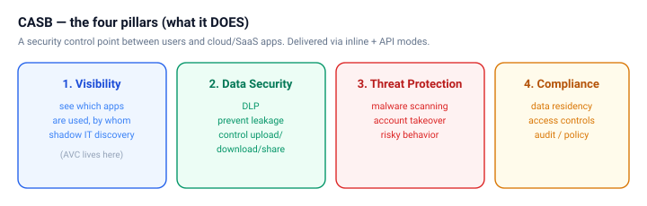
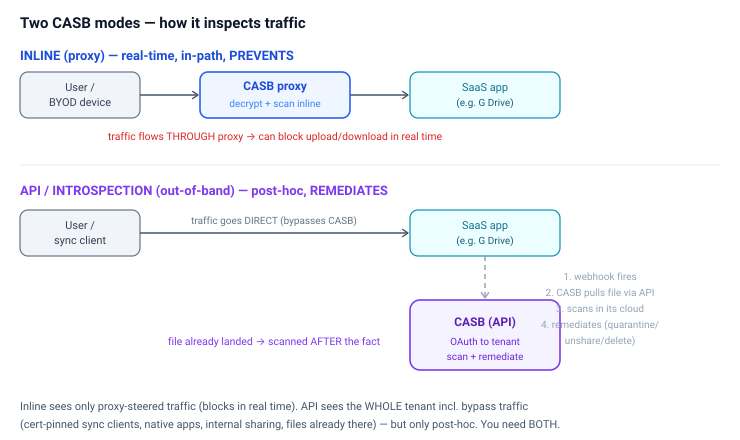
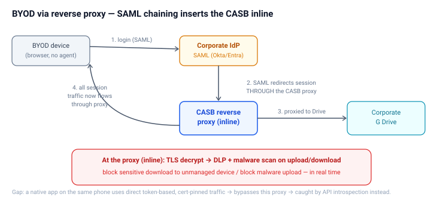
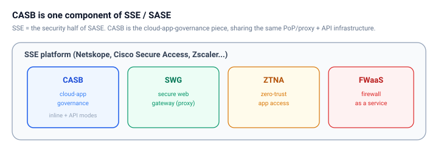

# CASB: Architecture, Modes & Content Scanning

A consolidated reference on Cloud Access Security Brokers — what a CASB *is* (the four
pillars), the two delivery modes (inline proxy vs. API/introspection), how users
authenticate, how BYOD and content scanning work, the architectural edge cases, and
where CASB sits in SSE/SASE.

> Diagrams are SVG images in `./diagrams/` — they render in VS Code, Chrome, and GitHub.

---

## 1. What a CASB is — the four pillars

A **CASB (Cloud Access Security Broker)** is a security control point that sits between
users and cloud/SaaS apps, giving an organization **visibility and control** over cloud
usage. It's *defined by what it does* — the four pillars — and *delivered via* two modes
(next section).

1. **Visibility** — see which cloud apps are used, by whom, what data moves; discover shadow IT. (**AVC** — Application Visibility and Control — lives here.)
2. **Data Security (DLP)** — protect sensitive data; control upload/download/sharing.
3. **Threat Protection** — malware scanning, account-takeover detection, risky-behavior detection.
4. **Compliance** — data residency, access controls, audit, policy enforcement.

**Modes are the *how*; pillars are the *what*.** Supporting both modes is CASB's defining
technical signature (Gartner: "multimode CASB").

---

## 2. The two modes — how a CASB inspects traffic

### Inline (proxy) — real-time, in-path, PREVENTS
- Sits **in the traffic path**; traffic flows **through** the CASB proxy.
- **Terminates TLS** → decrypts → inspects content in real time.
- Can **block** an upload/download **as it happens** (preventive).
- Sub-types: **forward proxy / client** (managed devices), **reverse proxy** (BYOD), **IPsec/GRE tunnels** (branch/site).
- **Limit:** only sees traffic that is *steered through it*; blind to bypass traffic.

### API / Introspection — out-of-band, post-hoc, REMEDIATES
- **Not in the traffic path.** Connects to the SaaS **tenant via API (OAuth)**.
- Uses a **webhook**: SaaS app *notifies* the CASB of a change → CASB **pulls the file via API** → scans in its own cloud → **remediates** (quarantine/unshare/delete).
- **Post-hoc:** the file already landed; there's a **latency window**; can't block in real time.
- **Strength:** sees the **whole tenant** regardless of path — including bypass traffic (cert-pinned sync clients, native apps, internal sharing) and **files already there** (scan the existing corpus). Frictionless OAuth deploy, no user-path latency.

> **Webhook precision:** content is NOT sent through the webhook. The webhook is the
> *notification* ("a file changed, resource ID X"); the CASB then *pulls* the content via
> the API to scan it. Notify → pull → scan → remediate.

### The key contrast

| | **Inline (proxy)** | **API / introspection** |
|---|---|---|
| Position | In the traffic path | Beside it (API-connected) |
| When it scans | Real-time, as content transits | Post-hoc, after file lands |
| Enforcement | **Block** in real time (preventive) | **Remediate** after (quarantine/delete) |
| Coverage | Only proxy-steered traffic | **Whole tenant** incl. bypass + data-at-rest |
| Deploy | Must be in path (proxy/client/tunnel) | Just OAuth + webhook, no path change |

**You need BOTH** — inline for real-time prevention on steerable traffic; API for
comprehensive coverage of everything that bypasses the proxy. Neither alone is complete.

---

## 3. How users authenticate — SAML, and where the CASB sits

Corporate SaaS auth is typically **SAML SSO to the corporate IdP** (Okta, Entra, Ping).
*Where the CASB sits relative to that auth depends on the mode:*

- **Inline (client):** user authenticates via SAML normally; the CASB **rides alongside** the session (steers traffic, applies policy) — it's not the authenticator.
- **Reverse proxy (BYOD):** the CASB **chains into the SAML flow** — the IdP redirects the authenticated session **through** the CASB proxy (proxy chaining / ACS routing). SAML is *the mechanism* that inserts the CASB inline for agentless devices.
- **API mode:** the CASB is **out of the user's auth entirely** — user does plain SAML to the app; the CASB separately holds an **OAuth grant** to the tenant to inspect data out-of-band. Two independent auths.

**Instance distinction:** the *corporate* instance is the one tied to the **corporate IdP/tenant**. A personal G Drive doesn't carry the corporate SAML/tenant context — which is how a CASB tells "corporate OneDrive" from "personal OneDrive" and applies instance-aware policy.

---

## 4. BYOD via reverse proxy — and where content scanning happens

For **BYOD / unmanaged devices** (no agent to steer traffic), access to corporate SaaS
goes through the **reverse proxy**, inserted via SAML chaining. Because the reverse proxy
is **inline in the session**, that's exactly **where content scanning happens**.

- The proxy **terminates TLS**, so it sees the actual file bytes in real time.
- **Upload:** inspect inline → DLP (sensitive data?) + malware scan → block/allow **before the upload completes**.
- **Download:** enforce policy before the file reaches the untrusted device — e.g. **block sensitive downloads to BYOD** (view-only in browser), watermark, or encrypt.
- BYOD is *why* inline matters most: the device is unmanaged, so the proxy is the **only control point** — "keep corporate data off the personal device."

**Inline scanning caveat:** deep sandboxing is slow, so *inline* malware scanning is
usually the faster checks (signature/reputation/DLP); deeper analysis often runs async.

---

## 5. The architectural edge cases (stress-testing the model)

### "Steered-through-proxy" vs. "bypasses-proxy" — the real dividing line
It's not "BYOD vs. sync client." It's **whether the traffic flows through the proxy**:
- **Steered → inline:** BYOD reverse proxy, managed-device client, branch tunnels.
- **Bypasses → only API catches it:** **sync clients** (Google Drive/OneDrive desktop — often **certificate-pinned**, reject proxy interception), **native mobile apps**, **direct API access**, **internal SaaS sharing** (never crosses the network).

### The BYOD paradox: corporate-authenticated ≠ proxy-steered
A **personal phone's native Drive app** can be **corporate-authenticated via SAML** yet
still **bypass the reverse proxy**, because:
- Native apps use **token-based OAuth** flows, then talk to the SaaS **directly** with the token — the ongoing data traffic never traverses the proxied *web* session.
- **Certificate pinning** makes the app reject any proxy TLS interception.
- No agent on the unmanaged device to force steering.

**Resolution:** the reverse proxy only owns the SAML **web-login** flow, so it controls
*browser* sessions — not native-app token traffic. Close the gap with:
1. **Conditional access** at the IdP (require proxied access; block native-app access from unmanaged devices; browser-only).
2. **API introspection as the backstop** — it sees the file in the tenant after it lands, regardless of path.

> This is *why* you need both modes: the native-app bypass is a concrete case where
> inline fails and introspection saves you.

---

## 6. Where CASB sits — one component of SSE / SASE

CASB isn't a standalone box in modern platforms — it's the **cloud-app-governance
capability** within an **SSE** platform (the security half of **SASE**), alongside:
- **SWG** — secure web gateway (web traffic proxy)
- **ZTNA** — zero-trust app access
- **FWaaS** — firewall as a service

It shares the platform's **inline proxy / PoP infrastructure** (for inline mode) and adds
**API connectors** (for introspection). Netskope, Cisco Secure Access, and Zscaler all
deliver CASB this way.

---

## 7. Quick-reference summary

- **CASB** = security control point between users and cloud apps; **four pillars** — visibility, data security (DLP), threat protection, compliance.
- **Two modes:** **inline** (proxy, in-path, real-time, *prevents*) and **API/introspection** (out-of-band, post-hoc, *remediates*). Multimode CASB = both.
- **Auth:** SAML SSO to corporate IdP. CASB is *beside* it (inline client), *in* it (reverse-proxy SAML chaining), or *separate* from it (API OAuth to tenant).
- **BYOD:** reverse proxy (agentless, via SAML chaining); content scanning happens **inline at the proxy** (TLS decrypt → DLP + malware on upload/download).
- **Webhook/API:** notify → pull file via API → scan in CASB cloud → remediate. (This is also **Abnormal's** model, specialized for email.)
- **Dividing line:** *steered-through-proxy* (inline) vs. *bypasses-proxy* (API catches it) — sync clients, native apps, cert-pinning, internal sharing all bypass inline.
- **Edge case:** corporate-authenticated ≠ proxy-steered (native app + token + cert-pinning bypasses reverse proxy) → close with conditional access + API introspection.
- **Place:** CASB is the cloud-app-governance piece of **SSE/SASE** (with SWG, ZTNA, FWaaS).
- **Mnemonic:** *Inline prevents what flows through it; introspection remediates everything, after the fact — you run both.*
