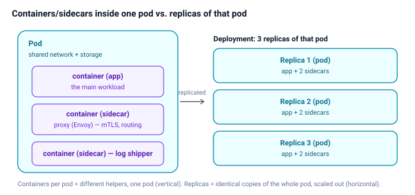
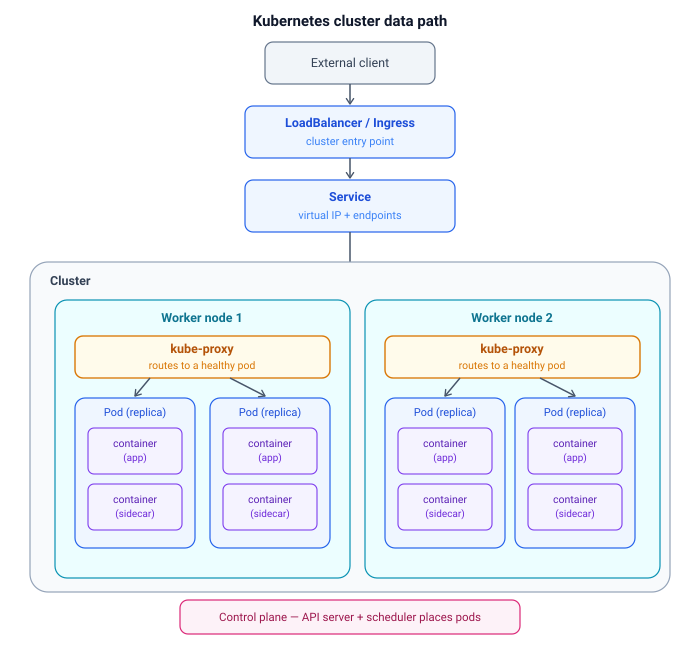
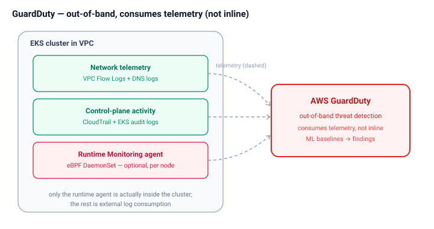
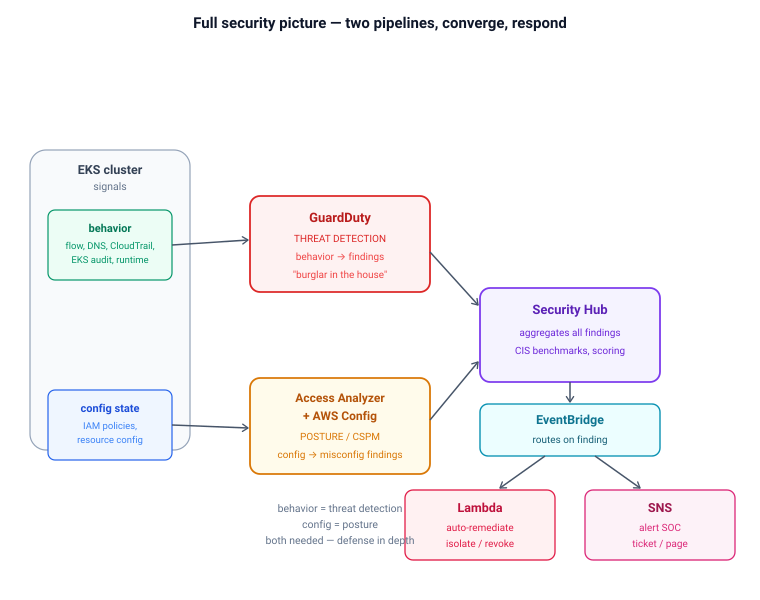

# Kubernetes: Structure, Load Balancing & Security

A consolidated reference covering the cluster building blocks (node, pod, replica,
container/sidecar), how load balancing works at two distinct levels, and how AWS
security services (GuardDuty, posture tools, Security Hub, automated response) fit
around an EKS cluster.

> Diagrams are SVG images in `./diagrams/` — they render in VS Code, Chrome, and GitHub.

---

## 1. Core building blocks — and the terminology that trips people up

| Term | What it actually is |
|------|---------------------|
| **Node** | A machine (VM or physical) that runs workloads. Each node runs its own `kube-proxy` and a container runtime. |
| **Pod** | The smallest deployable unit — a wrapper around **one or more containers** that share the same network (one IP, talk over `localhost`), storage volumes, and lifecycle. |
| **Container** | A running image inside a pod. A pod can hold several. |
| **Replica** | **One identical copy of a whole pod.** "3 replicas" = 3 identical pods. A replica *is* a pod — not something a pod contains. |
| **ReplicaSet** | Owns and maintains N identical replica pods (created/managed by a Deployment). |
| **Deployment** | Declares desired state (`replicas: N`, the pod template) and manages rollouts via its ReplicaSet. |

### Two things people wrongly merge

- **Containers per pod** (vertical) — different containers, *one* pod. E.g. a main **app** container + a **sidecar** (Envoy proxy, log shipper). They share IP, volumes, lifecycle.
- **Replicas of a pod** (horizontal) — identical copies of the *whole* pod, scaled out across nodes.

> **Sidecar is not a replica.** A sidecar is just another container in the same pod's
> `containers:` list — same kind of object as the app container; only its *role* differs
> (helper vs. main workload). Scaling to 5 replicas gives 5 copies of the whole
> app+sidecar bundle; you don't scale sidecars independently.



**Native sidecars (newer Kubernetes):** a sidecar can be formally declared as an init
container with `restartPolicy: Always`. That only controls start/stop *ordering*
(sidecar starts before app, stops after) — it's still a container in the same list, not
a different kind of entity.

**Cost note:** sidecars multiply container count — 3 replicas x 2 containers = 6 running
containers. Service meshes that inject a proxy into *every* pod add real overhead, which
is why ambient/eBPF meshes (Istio ambient, Cilium) move toward node-level proxies to
avoid the sidecar-per-replica multiplication.

---

## 2. The full cluster data path

External traffic flows down through the entry point, to a Service, to `kube-proxy`, to
the pods. Each pod holds its app + sidecar containers. The control plane places pods on
nodes.



**What each block does**

- **LoadBalancer / Ingress** — the front door. LoadBalancer = cloud L4 load balancer with a public IP; Ingress = L7 HTTP router (host/path routing, TLS termination). Never targets a pod directly.
- **Service** — stability layer: a fixed virtual IP (ClusterIP) plus a live list of healthy pod IPs (the **EndpointSlice**), updated as pods come/go and pass readiness checks.
- **kube-proxy** — one per node; programs kernel rules (iptables / IPVS / eBPF) so traffic to the Service's virtual IP is DNAT'd to a healthy pod IP. Not a proxy process each packet flows *through* — it sets up the rules and the **kernel** does the redirect.
- **Control plane** — the scheduler *places* pods on nodes; the API server tracks state and keeps the Service's endpoints current.

---

## 3. Load balancing happens at TWO levels

People conflate these. They solve different problems, at different times.

| Level | Distributes | Mechanism | When |
|-------|-------------|-----------|------|
| **Traffic** | Requests across replicas | Service + kube-proxy (iptables random / IPVS round-robin, least-conn) | Per request/connection |
| **Placement** | Replica pods across nodes | kube-scheduler (filtering + scoring) | Once, at pod creation |

### Level 1 — Traffic load balancing (requests -> replicas)

- Service holds the healthy endpoint list; kube-proxy DNATs each request to one pod.
- **iptables mode** — statistical/random selection (~equal weight).
- **IPVS mode** — real algorithms: round-robin (default), least-connections, weighted.
- **conntrack** pins a whole connection to the pod chosen for its first packet (per-connection, not per-packet).
- **Service mesh (Istio/Envoy)** moves LB to the L7 sidecar — richer algorithms (least-request, consistent hashing), per-request balancing, retries, circuit breaking.

### Level 2 — Pod scheduling (replica pods -> nodes)

The **kube-scheduler** places each replica pod in two phases:

1. **Filtering** — eliminate infeasible nodes (insufficient CPU/memory for the pod's *requests*, untolerated **taints**, node-affinity mismatch, unschedulable).
2. **Scoring** — rank feasible nodes and pick the best; by default favors less-loaded nodes, so replicas spread out naturally.

**Controlling distribution explicitly**

- **Pod anti-affinity** — "don't put two replicas on the same node" -> HA spread.

```yaml
affinity:
  podAntiAffinity:
    requiredDuringSchedulingIgnoredDuringExecution:
      - labelSelector: { matchLabels: { app: myapp } }
        topologyKey: kubernetes.io/hostname   # = different node
```

- **Topology spread constraints** — even spread across nodes/zones within a skew tolerance.

```yaml
topologySpreadConstraints:
  - maxSkew: 1
    topologyKey: topology.kubernetes.io/zone
    whenUnsatisfiable: DoNotSchedule
    labelSelector: { matchLabels: { app: myapp } }
```

- **Resource requests** — set accurately; they *drive* the scheduler's balancing.
- **Taints/tolerations + node affinity** — steer replicas toward/away from node types.

### The two distributions, together

1. Scheduler spreads the **pods** across nodes (compute + HA).
2. Service/kube-proxy spreads the **requests** across those pods (traffic).
3. **HPA** adds/removes replicas under load -> scheduler places new ones -> Service picks them up automatically.
4. On node failure: ReplicaSet notices the count dropped -> creates replacements -> scheduler places them on surviving nodes -> Service adds their IPs. Anti-affinity/topology-spread is what ensured one node didn't already hold too many replicas.

---

## 4. Where AWS GuardDuty fits — out-of-band, not inline

GuardDuty does **not** sit in the data path. It's an **out-of-band observer** that consumes
telemetry from multiple layers and emits *findings*.



**Three telemetry sources**

1. **Network — VPC Flow Logs + DNS logs** — C2 beaconing, crypto-mining, DNS exfiltration, known-bad domains/IPs. Foundational, always-on.
2. **Control plane — CloudTrail + EKS audit logs** — suspicious Kubernetes API activity (anonymous access, privilege escalation, dangerous `kubectl exec`, RBAC changes) and AWS-level IAM/credential abuse. *(Note: `kubectl exec` appears in the EKS audit log, not CloudTrail.)*
3. **Runtime — optional eBPF agent (DaemonSet, one per node)** — GuardDuty **Runtime Monitoring**; on-host/in-container process, file, and syscall behavior. The only component actually *inside* the cluster; everything else is external log consumption.

> **Key boundary:** GuardDuty detects **malicious behavior** (a compromised pod, an
> anomalous API call). It does **NOT** detect **misconfigurations** like an over-permissive
> IAM role or a privileged pod — that's *posture*, a different discipline (below).
> **GuardDuty catches the burglar; posture tools find the unlocked door.**

---

## 5. The full security picture — two pipelines, converge, respond

The single most important cloud-security distinction: **behavior vs. configuration** ->
two separate pipelines, converging at Security Hub, then driving automated response.



### The two pipelines

- **Threat detection (behavior):** telemetry -> **GuardDuty** -> detects *what's happening now* (active malicious activity). Reads activity streams.
- **Posture / CSPM (configuration):** config state -> **IAM Access Analyzer** (overly-broad & unused permissions, can generate least-privilege policies) **+ AWS Config** (config rules, drift, compliance) -> finds *latent misconfigurations*. Reads configuration state.

### Convergence & response

- **Security Hub** — aggregates *both* threat and posture findings, runs CIS/security-standard benchmarks, gives a unified score. The single pane of glass. (It also ingests GuardDuty findings natively.)
- **EventBridge** — routes findings by rule to automated actions.
- **Lambda** — auto-remediation: isolate a compromised pod (deny-all NetworkPolicy), revoke a leaked credential, quarantine an instance, fix a misconfig.
- **SNS** — alerting: page the SOC, open a ticket, notify Slack.

This is the **detect -> aggregate -> respond** loop (SOAR-style closed loop).

### One-line takeaway

> AWS security splits into two pipelines — **GuardDuty does threat detection off behavior
> telemetry**, while **Access Analyzer and Config do posture off configuration state** — and
> they **converge at Security Hub**, which aggregates and benchmarks, then **EventBridge drives
> automated response** via Lambda remediation and SNS alerts. You need both: posture shrinks
> the attack surface proactively; threat detection catches exploitation if it happens anyway
> — **defense in depth.**

---

## 6. Quick-reference summary

- **Pod** = wrapper around 1+ containers sharing network/storage/lifecycle.
- **Replica** = identical copy of a whole pod; **ReplicaSet** maintains N; **Deployment** manages it.
- **Sidecar** = just another container in the pod (role, not a different object type).
- **Traffic LB** = Service + kube-proxy (kernel iptables/IPVS) spreads requests across replicas.
- **Placement LB** = scheduler (filter -> score) spreads replica pods across nodes; anti-affinity / topology-spread for HA.
- **GuardDuty** = out-of-band threat detection from VPC/DNS logs, CloudTrail/EKS audit logs, optional eBPF runtime agent. Behavior, not posture.
- **Posture** = IAM Access Analyzer + AWS Config (misconfigurations, over-permissive IAM).
- **Security Hub** = aggregates both; **EventBridge -> Lambda/SNS** = automated response.
- **Mnemonic:** *GuardDuty catches the burglar; Access Analyzer finds the unlocked door — you need both.*
